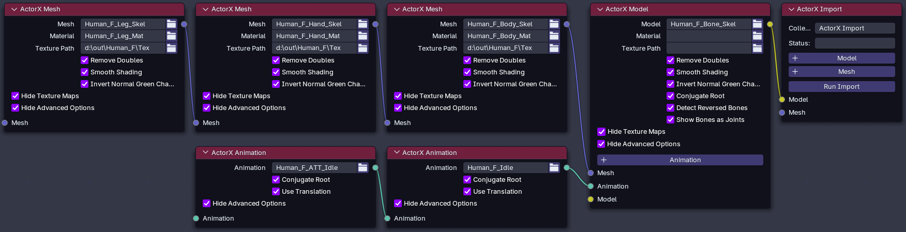

# Prototype Batch ActorX (psk, psa) Import addon for Blender 4

Import multiple models, meshes, textures and animations at a time. 
Visually build your import using custom nodes.

## Important Information

This is an advanced proof of concept in alpha. It may not import some assets correctly or crash Blender.

Full documentation will be added to the wiki as time permits. See Testing a Model to get started.

## Requirements

- Blender 4.2 or later. Blender 5.x is unsupported due to breaking API changes.
- ActorX assets exported from ueviewer (umodel).
- Knowledge of how ueviewer exports assets, especially where it saves the mat file and texture maps. 

## Getting Started

- Install and enable the addon.
- Export some assets using ueviewer. To simplify the import you should export assets into individual folders. For example: if you are exporting a model named Human_F_Heavy_Armor then put it into a folder of that name.
- Recommended: Move the texture maps into the same folder as the .mat file.

## Testing a Model

Try to import a single model without textures.

- Start Blender. 
- Change the editor type to "ActorX Import Node Tree".
- Click "New" at the top to add an empty node tree.
- Press "shift + a" and add an ActorX Import node and ActorX Model node.
- Connect the nodes.
- Select a model to import.
- Click "Run Import" then switch the editor to "3D Viewport" to see the results.

If nothing imports, the model is distorted or Blender crashes see the Troubleshooting section.

## Basic Node Information

### ActorX Import (required)

Adds an Import Node. This is the root node that all other nodes are connected to. Run the import from here.

- Inputs: Model Node, Mesh Node.
- \+ Model: Add another model input.
- \+ Mesh: Add another mesh input.

Mesh Node inputs can be a static mesh (usually .pskx) or a model (usually .psk). Only the mesh is imported from models.

### ActorX Model

Adds a Model Node. 

- Outputs: The Import Mode or another Model Node. 
- Inputs: Mesh Nodes, Animation Nodes and other Model Nodes.
- \+ Animation: Add another animation input.

Currently chained models are not parented to each other. They act as if they were connected to the Import Node.

Animation sockets are for adding standard animations, not partial or addon animations.

### ActorX Mesh

Adds a Mesh Node. 

- Outputs: A Model Node or another Mesh Node.
- Inputs: Another Mesh Node.

Chained meshes are added to the model in the order of connection.

Mesh Node inputs can be a static mesh (usually .pskx) or a model (usually .psk). Only the mesh is imported from models.

### ActorX Animation

Adds an Animation Node.

- Outputs: A Model Node or another Animation Node.
- Inputs: Another Animation Node.

Chained animations are designed for partial or add-on animations. They are added to the model in the order of connection.

## Materials and Textures (Model and Mesh Nodes)

To import textures a .mat file must be selected. 
Texture maps are searched for as follows:

- If a Texture Path is selected that folder is searched.
- If Texture Path is blank the .mat file folder is searched.

If any are used, the Diffuse, Specular and Normal map file selectors override the .mat file.

## Additional Animation Information

### NLA Tracks

Animations are added to separate NLA tracks at frame 1. Tracks are muted (disabled) by default. To view animations, open the Nonlinear Animation editor and toggle the track(s) you want to view.

### Partial / Addon Animations

Animations that are designed to run at the same time are added via chained nodes and can be problematic. 

- The correct one(s) can be difficult to for you to locate.
- They may fail to load.
- They may not attach to the bones correctly.
- They may be distorted.

The strips (actions) on the correct ones may differ in one or more of the following ways:

- Have a different number.
- May not be in the same order.
- May not have the same length.

In these cases they will not line up with each other. You will have to try and manually align them for proper playback. Some actions may need to be scaled to match. In my limited testing this is the case more often than not.

## Troubleshooting

### Blender Crashes

Start Blender from a command line. After it crashes copy the output and paste it into a new issue with a screenshot of the node tree.

### Nothing Imports

Open the Blender console. A trace log is output there. Copy the output and paste it into a new issue with a screenshot of the node tree.

### Distorted Models

Try changing combinations of the root, non-root and axis forward (usually X to -X) settings. 

For animations also try the use translation setting. If nothing helps the addon is currently incompatible with your asset(s).